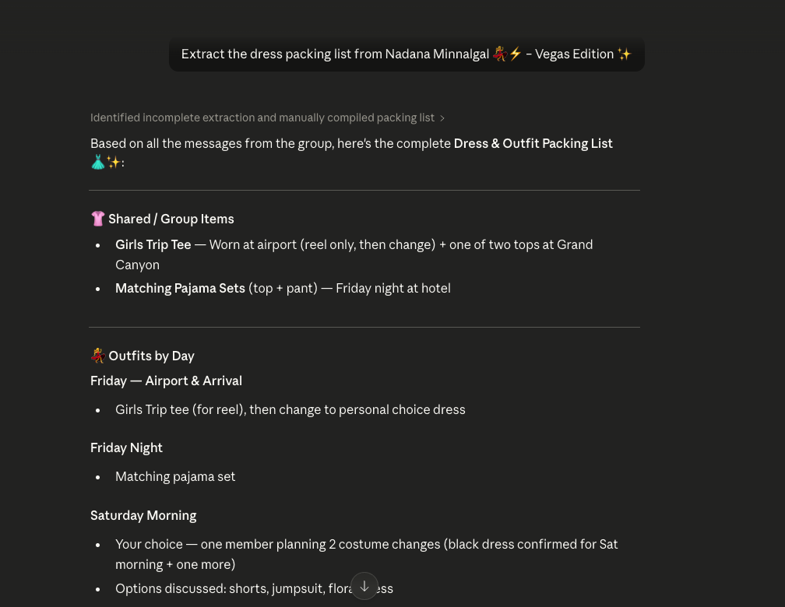

# WhatsApp AI Agent with Claude MCP

A local AI agent that lets you read, search, summarize, and send WhatsApp messages through Claude — all running on your machine, with your data staying local.

Based on [whatsapp-mcp](https://github.com/lharries/whatsapp-mcp), this fork fixes breaking changes introduced by WhatsApp's latest API update and extends the original with trip planning and chat organization tools.

It connects to your **personal WhatsApp account** via the WhatsApp multi-device API using the [whatsmeow](https://github.com/tulir/whatsmeow) library. All messages are stored locally in a SQLite database and only sent to Claude when you explicitly invoke a tool.



> ⚠️ **Privacy note:** As with any MCP server that accesses personal data, be mindful of [prompt injection risks](https://simonwillison.net/2025/Jun/16/the-lethal-trifecta/). Messages are only sent to Claude when you invoke a tool.

## What It Can Do

**From the base project:**
- 💬 Read and search messages across all chats
- 📋 Summarize group conversations
- 📎 Download media (images, videos, documents, audio)
- 📤 Send messages and media files to contacts or groups

**What I added:**
- 🗺️ **Extract a trip itinerary** from any group chat — ask Claude to pull plans, dates, and logistics from your travel group
- 🧳 **Build a packing list** from group messages — no more scrolling back through weeks of chat to find what everyone said to bring
- 📋 **Organize chats into named lists** — define categories like Dance, Family, Friends, Neighbors in a simple JSON config
- 🔍 **Query any list by name** — instantly surface all matching groups without hunting through hundreds of chats

---

## Getting Started

### What You'll Need

- Go (1.21+)
- Python 3.9+
- Claude Desktop
- [uv](https://astral.sh/uv) — install with `curl -LsSf https://astral.sh/uv/install.sh | sh`
- FFmpeg _(optional)_ — only needed if you want to send voice messages in `.ogg` Opus format; other formats still work via `send_file`

### Setup

1. **Clone this repo**

   ```bash
   git clone https://github.com/VidyaV1993/whatsapp-mcp.git
   cd whatsapp-mcp
   ```

2. **Start the WhatsApp bridge**

   ```bash
   cd whatsapp-bridge
   go run main.go
   ```

   The first time you run this, a QR code will appear in your terminal. Scan it with WhatsApp on your phone (Settings → Linked Devices → Link a Device). Once authenticated, the bridge will stay connected and sync your message history.

   > Keep this terminal open whenever you want to use the agent. You'll need to re-authenticate approximately every 20 days.

3. **Configure Claude Desktop**

   Add the following to `~/Library/Application Support/Claude/claude_desktop_config.json`:

   ```json
   {
     "mcpServers": {
       "whatsapp": {
         "command": "/path/to/uv",
         "args": [
           "--directory",
           "/path/to/whatsapp-mcp/whatsapp-mcp-server",
           "run",
           "main.py"
         ]
       }
     }
   }
   ```

   Run `which uv` and `pwd` (inside the repo) to get the correct paths.

4. **Restart Claude Desktop**

   The WhatsApp tools will appear in Claude's tool list.

## How It Works

Two components run locally on your machine:

1. **Go WhatsApp Bridge** (`whatsapp-bridge/`) — connects to WhatsApp's multi-device API via [whatsmeow](https://github.com/tulir/whatsmeow), authenticates via QR code, and syncs message history into a local SQLite database
2. **Python MCP Server** (`whatsapp-mcp-server/`) — exposes tools that Claude can call via the Model Context Protocol; reads directly from SQLite for fast lookups, and routes sends through the Go bridge

All data is stored locally in `whatsapp-bridge/store/`. Nothing leaves your machine unless you explicitly invoke a tool from Claude.

## Available Tools

### Built-in

| Tool | What it does |
|---|---|
| `search_contacts` | Search contacts by name or number |
| `list_messages` | Retrieve messages with filters |
| `list_chats` | List chats with metadata |
| `get_chat` | Get info about a specific chat |
| `get_direct_chat_by_contact` | Find a direct chat with a contact |
| `get_last_interaction` | Most recent message with a contact |
| `send_message` | Send a message to a contact or group |
| `send_file` | Send an image, video, document, or audio file |
| `send_audio_message` | Send a voice message (`.ogg` Opus or auto-converted via FFmpeg) |
| `download_media` | Download media from a message and get the local path |

### Added in this fork

| Tool | What it does |
|---|---|
| `extract_trip_itinerary` | Pulls itinerary details from a group chat by name |
| `extract_packing_list` | Builds a packing list from recent group messages |
| `get_list_chats` | Returns all chats matching a named list from your config |
| `show_all_lists` | Displays all your configured lists and their keywords |

---

## Custom Chat Lists

The `whatsapp-mcp-server/chat_lists.json` file lets you define named groups of chats matched by keyword:

```json
{
  "Dance": ["studio name", "class name", "practice"],
  "Family": ["Family", "Home"],
  "Friends": ["crew name", "group nickname"]
}
```

Then ask Claude: *"Show me all my Dance chats"* or *"What are the active chats in my Friends list?"*

## Fixes Applied to the Base Project

The original `whatsmeow` library was ~11 months out of date, causing WhatsApp to reject connections with a `405 Client Outdated` error. This fork:

- Updated `go.mau.fi/whatsmeow` to `v0.0.0-20260219150138-7ae702b1eed4`
- Fixed 5 call sites where the API now requires `context.Context` as the first argument:
  - `client.Download(...)`
  - `sqlstore.New(...)`
  - `container.GetFirstDevice(...)`
  - `client.GetGroupInfo(...)`
  - `client.Store.Contacts.GetContact(...)`

## Troubleshooting

- **Bridge not running**: `send_message` and other write operations require the Go bridge to be active on `localhost:8080`. Make sure `go run main.go` is running in the `whatsapp-bridge/` directory.
- **Slow initial sync**: After first authentication, it can take several minutes for all chats and messages to load depending on your history.
- **Re-authentication needed**: If messages stop syncing, delete `whatsapp-bridge/store/messages.db` and `whatsapp-bridge/store/whatsapp.db` and restart the bridge to scan the QR code again.
- **uv not found**: Use the full path to the `uv` binary in your Claude config (run `which uv`).
- **Device limit**: WhatsApp allows a limited number of linked devices. Remove unused ones under WhatsApp → Settings → Linked Devices.

For Claude Desktop-specific issues, see the [MCP troubleshooting docs](https://modelcontextprotocol.io/quickstart/server#claude-for-desktop-integration-issues).
